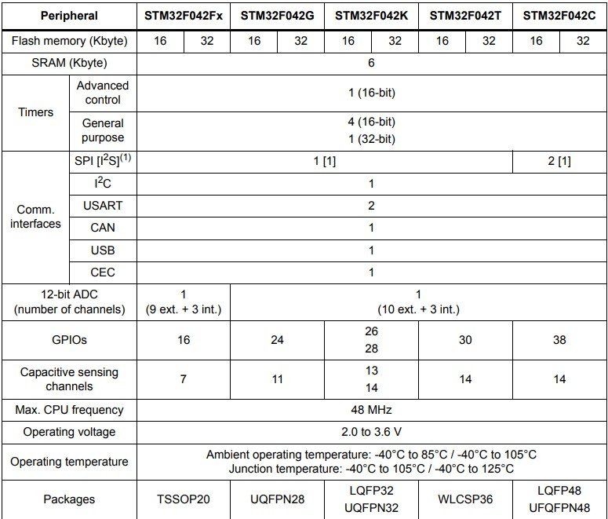

# [STM32F042](https://github.com/sochub/STM32F042)
 
#### 厂商：[ST](https://github.com/sochub/ST)
#### 父级：[STM32F0](https://github.com/sochub/STM32F0)
#### 架构：[cortex M0](https://github.com/sochub/CM0)
#### 芯片定级：[Level](https://github.com/sochub/Level)
## [描述](https://github.com/sochub/STM32F042) 

[ST](https://github.com/sochub/ST) 意法半导体基于ARM Cortex®-M0的STM32 F0系列单片机实现了32位性能，同时传承了STM32系列的重要特性，特别适合成本敏感型应用。

### [资源收录](https://github.com/sochub/STM32F042)

* [文档](docs/)
* [资源](src/)

### [关联资源](https://github.com/sochub)

* [SDK](https://github.com/sochub/SDK)

### [选型建议](https://github.com/sochub)

[STM32F042](https://github.com/sochub/STM32F042)系列是入门级32位单片机

###  [SoC资源平台](http://www.qitas.cn)
