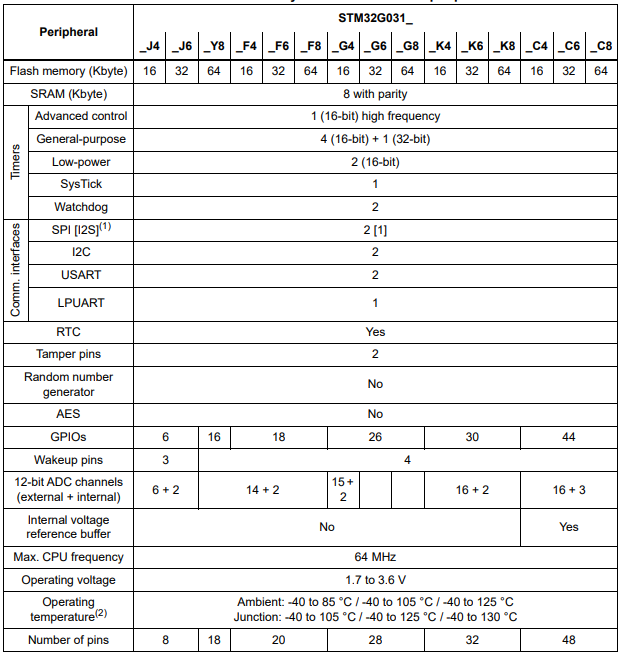

# [STM32G031](https://github.com/SoCXin/STM32G031)

#### [Vendor](https://github.com/SoCXin/Vendor)：[ST](https://www.st.com/zh/)
#### [Core](https://github.com/SoCXin/Cortex)：[Cortex-M0](https://github.com/SoCXin/CM0)
#### [Level](https://github.com/SoCXin/Level)：64MHz

## [简介](https://github.com/SoCXin/STM32G031/wiki)

[STM32G031](https://github.com/SoCXin/STM32G031) devices incorporate a memory protection unit (MPU), high-speed embedded memories (8 Kbytes of SRAM and up to 64 Kbytes of Flash program memory with read protection, write protection, proprietary code protection, and securable area), DMA, an extensive range of system functions, enhanced I/Os, and peripherals.

The devices offer standard communication interfaces (two I2Cs, two SPIs / one I2S, and two USARTs), one 12-bit ADC (2.5 MSps) with up to 19 channels, an internal voltage reference buffer, a low-power RTC, an advanced control PWM timer running at up to double the CPU frequency, four general-purpose 16-bit timers, a 32-bit general-purpose timer, two low-power 16-bit timers, two watchdog timers, and a SysTick timer.

#### 关键特性

* 12-bit ADC (2.5 MSps)
* two I2Cs, two SPIs / one I2S, and two USARTs

### [资源收录](https://github.com/SoCXin/STM32G031)

* [参考文档](docs/)
* [参考资源](src/)
* [参考工程](project/)

### [选型建议](https://github.com/SoCXin)

[STM32G031](https://github.com/SoCXin/STM32G031)

###  [www.SoC.xin(芯)](http://www.SoC.Xin)
